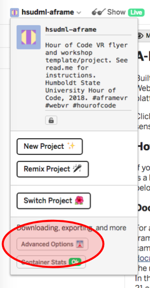
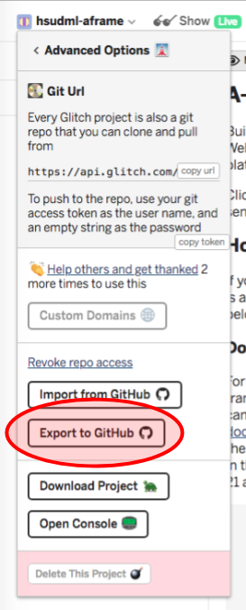
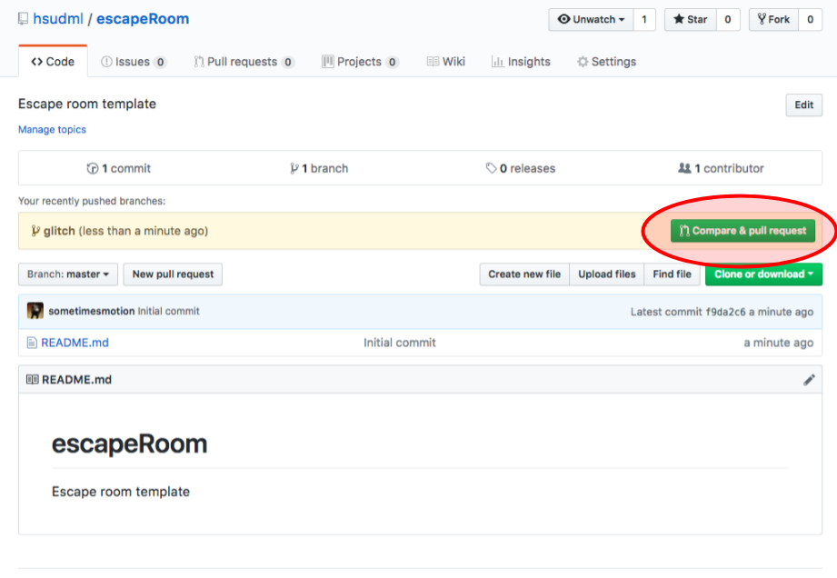
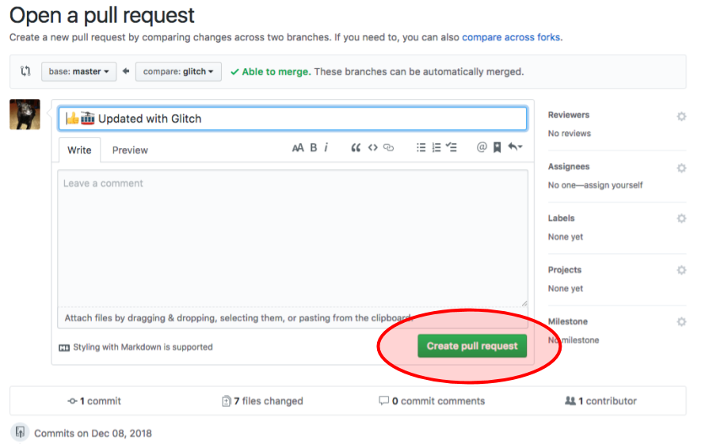
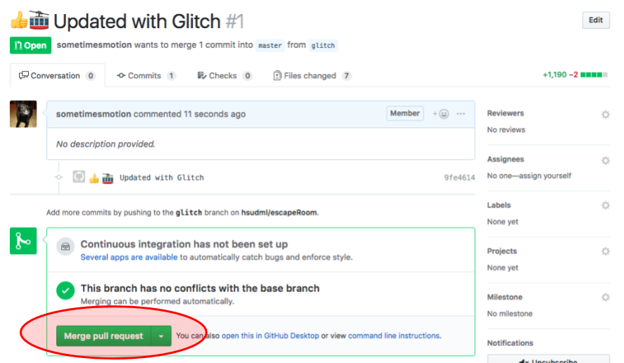

# Glitch.com
Tips on using Glitch with GitHub. [Glitch](https://glitch.com/) is a great platform for web development and WebVR.

## Export Glitch Project to GitHub

Video instructions: [How to export a Glitch projct to GitHub](https://youtu.be/aWJFbtrgW4E) (Maurice Cherry, Glitch)

### Basics

1. [Create a new repo in GitHub](https://help.github.com/articles/create-a-repo/). This can be a basic user repo or an organizational repo. If it is an organization, be sure to substitute the organization name for the user name in the later step. (Learn about the [Differences between user and organization accounts](https://help.github.com/articles/differences-between-user-and-organization-accounts/). As an example, [HSUDML](https://github.com/hsudml) is an organization and [sometimesmotion](https://github.com/sometimesmotion) is my user account.)

2. Go to your project in Glitch. Click on 'Advanced Options' under the project details drop-down menu (where the name of your project is in the upper right-hand corner). 

3. From there, click on the 'Export to GitHub' option. _Note: if the export option is grayed out, you will need to grant Glitch permission to your GitHub account, simply click the link above the grayed out button 'Grant access to import and export to a repo' to set that up._

4. A pop-up window will ask you for your user/repo names. The user name will be either your GitHub account name or your organization name (I haven't tested this, but I'm assuming you need to at least be an admin of the org to do this- it could be limited to the org's creator). The repo name is the one you just created in step 1. 

5. A new popup will ask you for a commit comment. You can change the default or just leave it. 

6. Go back to your GitHub repo and (you may need to refresh) select the 'compare & pull request' button.

7. From this new page you can scroll to review your code, add a description, change the pull request name and more. But assuming everything is good, go ahead and click the 'Create pull request' button. 

8. Click 'Merge pull request' and then 'Confirm merge.'

9. Double-check your new repo and sit back and celebrate! 

